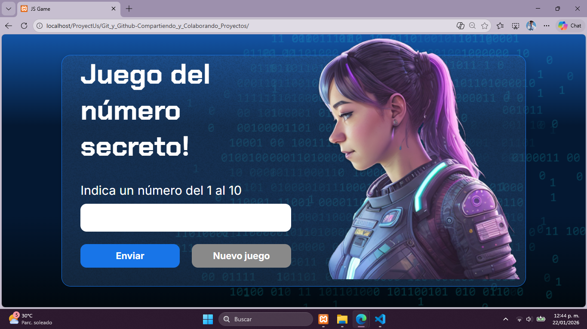
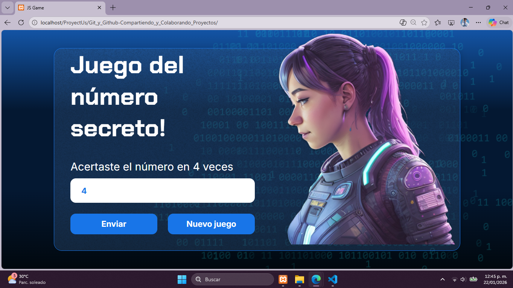

# 🎯 Juego del Número Secreto

Proyecto desarrollado como parte de las prácticas del programa **Alura Latam**, utilizando **HTML, CSS y JavaScript**.  
Este juego representó un reto creativo y muy enriquecedor, ideal para fortalecer la lógica de programación y el desarrollo web.

---

## 📌 Descripción del proyecto

**Juego del Número Secreto** es una aplicación interactiva donde el usuario debe adivinar un número generado aleatoriamente por el sistema.  
El juego proporciona pistas indicando si el número ingresado es mayor o menor al número secreto, hasta que el usuario logra acertar.

Este proyecto fue una excelente oportunidad para aplicar conceptos fundamentales de JavaScript y mejorar mis habilidades como desarrollador.

---

## 📸 Capturas del proyecto

### Pantalla inicial del juego
<p align="center">
  
</p>

### Juego en ejecución / Resultado
<p align="center">
  
</p>

---

## 🛠️ Tecnologías utilizadas

- **HTML5** – Estructura del proyecto  
- **CSS3** – Diseño y estilos visuales  
- **JavaScript** – Lógica del juego e interacción con el usuario  

---

## ⚙️ Funcionalidades

- Generación de un número secreto aleatorio
- Validación de números ingresados
- Mensajes dinámicos con pistas (mayor / menor)
- Conteo de intentos
- Reinicio del juego
- Interfaz clara e intuitiva

---

## 📚 Aprendizajes obtenidos

Durante el desarrollo de este proyecto aprendí y reforcé:

- Uso de variables y funciones en JavaScript
- Condicionales y estructuras de control
- Manipulación del DOM
- Manejo de eventos
- Organización de archivos en un proyecto web
- Buenas prácticas de programación

---

## 🌟 Motivación

Este proyecto me pareció un reto **muy creativo y motivador**, ya que combina lógica, interacción con el usuario y diseño.  
Fue una experiencia de mucho aprendizaje dentro del programa de **Alura Latam**, que reforzó mis bases en desarrollo web y me impulsó a seguir creando proyectos.

---

## 📂 Estructura del proyecto

```text
📁 Git_y_Github-Compartiendo_y_Colaborando_Proyectos
|── 📁 Apuntes
|   └── Curso 1- Tema 12- Llave SSH.md
│── 📁 img
│       ├── ia.png
│       └── Ruido.png
        └── captura-Inicio.png
        └── captura-Resultado.png
│── app.js
│── index.html
│── README.md
│── style.css
